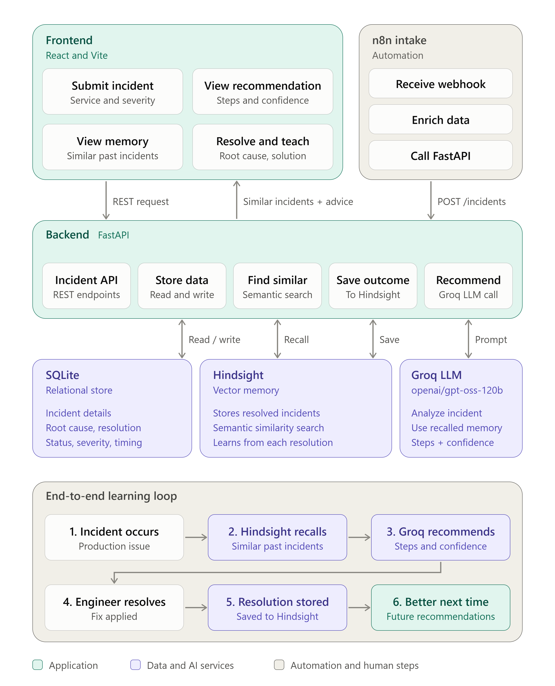

# ⚡ IncidentPilot AI

IncidentPilot AI is a memory-powered production incident response agent that learns from previously resolved incidents and uses that experience to diagnose new failures.

Instead of treating every production issue as a new problem, IncidentPilot recalls similar incidents using Hindsight, combines those memories with the current failure, and generates an evidence-grounded troubleshooting recommendation.

---

## The Problem

Engineering teams repeatedly encounter similar production failures:

- Database connection exhaustion
- API timeouts
- Deployment failures
- Service crashes
- Infrastructure issues

The resolution may already exist in an old incident or postmortem, but engineers often spend valuable time rediscovering it.

IncidentPilot turns previous incident resolutions into reusable operational memory.

---

## How IncidentPilot Works

```text
Production Incident
        ↓
Incident Intake
        ↓
FastAPI Backend
        ↓
Hindsight Memory Recall
        ↓
Similar Historical Incidents
        ↓
Groq LLM
        ↓
Evidence-Grounded Recommendation
        ↓
Engineer Resolves Incident
        ↓
Resolution Stored in Hindsight
        ↓
Future Incidents Get Better Recommendations

## System Architecture



Live frontend: https://incidentpilot-ai-sigma.vercel.app
Backend: https://incidentpilot-ai-backend.onrender.com
API docs: https://incidentpilot-ai-backend.onrender.com/docs